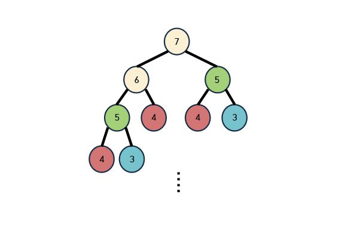

## 다이나믹 프로그래밍(DP)

### 개념

큰 문제를 작게 나누고, 같은 문제라면 한번씩만 해결해 문제를 효율적으로 해결하는 알고리즘 기법
즉, 중복되는 연산을 줄일수 있는 알고리즘이다



### 종류

- 탑다운방식(하향식)

  - 메모이제이션(캐싱)기법
    - 한번 구한 결과를 메모리공간에 저장 후 같은 문제 호출시 메모리에서 가져온다
    - 한번 구한 결과를 메모리공간 즉, 리스트나 배열에 저장한다
    - 일시적으로 결과를 기록하는 개념
    - 수열처럼 연속적이지 않은 사전자료형과 같은 경우에 유용하다
    - 3차원 문제같은 경우는 최단경로(플로이드 워셜)에서 다룬다
  - 재귀함수적 요인이 있다

- 보텀업방식(상향식)
  - 재귀보다는 반복문을 활용한 방식(성능이 더 우수하다)
  - 작은 문제부터 답을 도출하는 방식

### 예시(피보나치 수열)

> 재귀

```
def fibo(n):
  if x==1 or x==2:
    return 1
  return fibo(x-1)+fibo(x-2)
```

> 탑다운

```
dp = [0] * 1000

def fibo(n):
  if x==1 or x==2:
    return 1
  if dp[x] !=0:
    return dp[x]
  dp[x] = fibo(x-1)+fibo(x-2)
  return dp[x]
```

> 보텀업

```
dp = [0] * 1000
dp[1]=1
dp[2]=1

for i in range(2,x+1):
  d[i] = d[i-1] + d[i-2]
```
